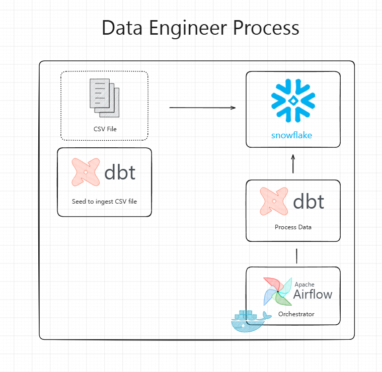
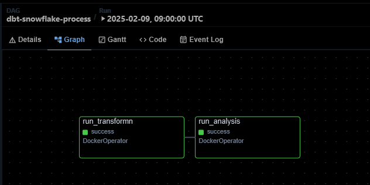

# dbt-snowflake-airflow

Data engineering project using Apache Airflow, Snowflake, and dbt.

This project was initially based on the YouTube tutorial [here](https://www.youtube.com/watch?v=mBrk5hvqc84) by [@wlcamargo](https://github.com/wlcamargo) (in Portuguese) and the file organization was modified following dbt best practices for splitting SQL into staging, intermediate and marts layers as discussed in [this dbt Community Forum thread](https://discourse.getdbt.com/t/best-practice-splitting-sql-into-staging-intermediate-and-marts-layers-and-naming-conventions/11372).

## Architecture



## Step by step contained in this repo

1. Create a Snowflake account
2. Install Docker
3. Connect dbt to Snowflake
4. Ingest data from a Fake API to Snowflake with dbt
5. Create the dbt image in a container
6. Orchestrate the dbt container connected to Snowflake with Airflow

## Requirements

- Docker and Docker Compose
- Python >= 3
- Snowflake account (https://signup.snowflake.com/)

## Installation

**1. Run the WSL in your PowerShell**

<br>

**2. Clone the repository in the Ubuntu folder:**
```bash
git clone https://github.com/czelusniak/ecommerce-data-pipeline.git
cd dbt-snowflake-airflow
```

<br>

**3. Install Docker:**
   - Follow the official Docker installation guide for your operating system:
     - [Docker Desktop for Windows](https://docs.docker.com/desktop/install/windows-install/)
     - [Docker Desktop for Mac](https://docs.docker.com/desktop/install/mac-install/)
     - [Docker Engine for Linux](https://docs.docker.com/engine/install/)
   - Verify the installation:
     ```bash
     docker --version
     docker compose version
     ```

<br>

**4. Run Snowflake setup SQL commands:**
   - Open a Snowflake worksheet and execute the SQL commands from `scripts/snowflake-setup.sql` in your Snowflake account
   - This will create the necessary warehouse, database, schema, role, and user for dbt

<br>

**5. On WSL, create and activate a virtual environment:**
```bash
python3 -m venv venv
source venv/bin/activate
```

<br>

**6. Install requirements:**
```bash
pip install -r requirements.txt
```
> **Note:** Make sure your virtual environment is activated for the following steps.

<br>

**7. Verify dbt installation:**
```bash
dbt --version
```

<br>

**8. Start and access Airflow:**
```bash
cd airflow
docker compose up -d
```

Expected result:


- Access the Airflow using the URL: http://localhost:8081
- Username: `airflow`
- Password: `airflow`

<br>

**9. Configure Snowflake connection:**
   - Rename `src/dbt/example-profiles.yml` to `profiles.yml`
   - Edit `src/dbt/profiles.yml` and replace `your-account-here` with your Snowflake account name

<br>

**10. Test dbt connection with Snowflake:**
```bash
cd src/dbt && dbt debug
```
Expected result:


<br>

**11. Airflow Configuration: Snowflake Connection**

1. **Access the Interface**
    * Open your browser and go to your Airflow UI (e.g., `http://localhost:8080`).

2. **Navigate to Connections**
    * In the top menu, click on **Admin** and then select **Connections**.

3. **Locate the Connection**
    * Search the list for a connection named `snowflake_default`.
    * **If it exists:** Click the pencil icon (**Edit**) next to it.
    * **If it does not exist:** Click the blue **+** button to create a new one.

4. **Enter Connection Details**
    * **Connection Id:** `snowflake_default`
    * **Connection Type:** `Snowflake`
    * **Account:** Your new Account Name (e.g., `xy12345-ab98765`).
    * **Login:** Your Snowflake username.
    * **Password:** Your Snowflake password.
    * **Database:** `ECOMMERCE_DB` (the database that was created previously).

5. **Test and Save**
    * Scroll to the bottom of the page and click the **Test** button.
    * If a green bar appears saying **"Connection successful"**, click **Save**.

<br>

**12. Create Docker image for dbt:**
   - Create the dbt Docker image:
   ```bash
   cd src
   docker build -t dbt-snowflake .
   ```
   - Enter the dbt container (optional, for debugging):
   ```bash
   docker run -it dbt-snowflake /bin/bash
   ```
   > **Note:** This Docker image will be used by Airflow to run dbt transformations.


**13. Test the container:**
   - Modify the data in the `seeds/` directory
   - Run the seed command again:
   ```bash
   cd src/dbt && dbt seed
   ```
   - Verify the updates in your Snowflake account


**14. View orchestration in Airflow:**

You can see the DAG (Directed Acyclic Graph) in the Airflow UI:




## Stopping the Project

To stop the project and free up system resources, run:

```bash
cd airflow
docker compose down
```

## Project Structure

The project follows dbt best practices with a layered architecture:

```
src/dbt/
├── models/
│   ├── staging/       # Staging models - initial data cleaning and standardization
│   ├── intermediate/  # Intermediate models - business logic transformations
│   └── marts/         # Mart models - final analytics-ready tables
├── macros/            # Reusable SQL macros
└── profiles.yml       # Snowflake connection configuration
```

## References

- [Base repo](https://github.com/jacob-mennell/snowflakeAirflowDBT)
- [Base repo 2](https://github.com/wlcamargo/dbt-snowflake-airflow)
- [Snowflake Guide](https://quickstarts.snowflake.com/guide/data_engineering_with_apache_airflow/index.html)
